# Mission03. No-Code 자동화 도구 활용 과제

## 과제 개요

본 과제는 노코드 자동화 도구를 활용하여 실제로 동작하는 자동화 워크플로우를 설계하고 구현하는 것을 목표로 한다.

총 2개의 프로젝트를 수행했다.

1. **프로젝트 1: 자동화 도구 비교 구현**
   - 동일한 자동화 워크플로우를 Make와 Zapier로 각각 구현하고 비교 분석했다.

2. **프로젝트 2: 자유 주제 자동화 설계 및 구현**
   - 홍보 포스터 제작 문의 자동 분류 및 알림 시스템을 Make로 구현했다.

---

# 프로젝트 1. 자동화 도구 비교 구현

## 1. 프로젝트 개요

프로젝트 1에서는 동일한 자동화 워크플로우를 서로 다른 노코드 자동화 도구인 **Make**와 **Zapier**로 각각 구현하고, 두 도구의 특징과 장단점을 비교했다.

구현한 자동화 주제는 **문의 접수 자동 분류 및 알림 시스템**이다.

Google Form으로 문의가 접수되면 Google Sheets에 응답이 저장되고, 자동화 도구가 새 응답을 감지한다. 이후 문의 우선순위에 따라 긴급 문의와 일반 문의로 분기하고, 각 분기별로 Google Sheets의 별도 탭에 기록한 뒤 Gmail로 알림을 전송한다.

---

## 2. 자동화 워크플로우

```text
Google Form 문의 제출
↓
Google Sheets 응답 저장
↓
자동화 도구가 새 응답 감지
↓
문의 우선순위 기준 조건 분기
├─ 긴급 문의
│  ├─ 긴급문의 시트에 행 추가
│  └─ Gmail 긴급 알림 전송
└─ 일반 문의
   ├─ 일반문의 시트에 행 추가
   └─ Gmail 일반 알림 전송
```

## 3. Google Form 입력 항목

| 항목 | 설명 |
|---|---|
| 성함 | 문의자 이름 |
| 연락처 또는 이메일 | 문의자의 연락처 정보 |
| 문의 우선순위 | 긴급 / 일반 |
| 문의 상세 내용 | 문의 내용 |
| 희망 처리 방식 | 이메일 답변 / 전화 상담 |
| 테스트 구분 | Make 테스트 / Zapier 테스트 |

조건 분기의 기준은 **문의 우선순위** 필드이다.

---

## 4. Google Sheets 구성

| 시트 탭 이름 | 용도 |
|---|---|
| Form_Responses | Google Form 원본 응답 저장 |
| 긴급문의 | 긴급 문의 자동 기록 |
| 일반문의 | 일반 문의 자동 기록 |

`긴급문의`와 `일반문의` 탭의 헤더는 다음과 같이 구성했다.

```text
타임스탬프 | 성함 | 연락처 또는 이메일 | 문의 우선순위 | 문의 상세 내용 | 희망 처리 방식 | 테스트 구분 | 처리상태
```

---

## 5. Make 구현

### Make 워크플로우 구조

```text
Google Sheets - Watch New Rows
↓
Router
├─ 긴급 문의 필터
│  ├─ Google Sheets - Add a Row → 긴급문의
│  └─ Gmail - Send an Email → 긴급 알림
└─ 일반 문의 필터
   ├─ Google Sheets - Add a Row → 일반문의
   └─ Gmail - Send an Email → 일반 알림
```

### Make 구성 요소

| 구분 | 내용 |
|---|---|
| Trigger | Google Sheets - Watch New Rows |
| Router | 긴급 문의 / 일반 문의 분기 |
| Filter 1 | 문의 우선순위 = 긴급 |
| Filter 2 | 문의 우선순위 = 일반 |
| Action 1 | Google Sheets - Add a Row |
| Action 2 | Gmail - Send an Email |

### Make 실행 결과

| 테스트 | 결과 |
|---|---|
| 긴급 문의 테스트 | 긴급문의 탭에 기록되고 Gmail 긴급 알림 도착 |
| 일반 문의 테스트 | 일반문의 탭에 기록되고 Gmail 일반 알림 도착 |

---

## 6. Zapier 구현

Zapier에서는 동일한 자동화 흐름을 긴급용 Zap과 일반용 Zap으로 나누어 구현했다.

### 긴급 문의 Zap

```text
Google Sheets - New or Updated Spreadsheet Row
↓
Filter by Zapier
- 문의 우선순위 = 긴급
↓
Google Sheets - Create Spreadsheet Row → 긴급문의
↓
Gmail - Send Email → 긴급 알림
```

### 일반 문의 Zap

```text
Google Sheets - New or Updated Spreadsheet Row
↓
Filter by Zapier
- 문의 우선순위 = 일반
↓
Google Sheets - Create Spreadsheet Row → 일반문의
↓
Gmail - Send Email → 일반 알림
```

### Zapier 실행 결과

| 테스트 | 결과 |
|---|---|
| 긴급 문의 테스트 | 긴급문의 탭에 기록되고 Gmail 긴급 알림 도착 |
| 일반 문의 테스트 | 일반문의 탭에 기록되고 Gmail 일반 알림 도착 |

---

## 7. Make와 Zapier 비교 분석

| 비교 항목 | Make | Zapier |
|---|---|---|
| UI/UX | 노드 기반 시각적 화면으로 전체 흐름을 한눈에 보기 쉬움 | 단계형 리스트 구조로 순서대로 설정하기 쉬움 |
| 설정 난이도 | Router와 Filter 개념을 이해해야 해서 초반 진입 장벽이 있음 | 각 단계가 안내형으로 구성되어 초보자가 따라가기 쉬움 |
| 조건 분기 방식 | Router를 통해 하나의 시나리오 안에서 긴급/일반 분기 구현 가능 | 무료 플랜에서는 Paths 사용이 제한될 수 있어 Zap을 2개로 나누어 구현 |
| 실행 로그 확인 | 각 모듈별 데이터 흐름과 분기 통과 여부를 시각적으로 확인 가능 | Test run과 Zap History를 통해 단계별 성공 여부 확인 가능 |
| 무료 플랜 활용성 | 비교적 복잡한 분기 구조도 무료 범위에서 구현하기 쉬움 | 단순 자동화에는 적합하지만 복잡한 분기에는 제한이 있을 수 있음 |
| 확장성 | 복잡한 분기와 여러 경로가 있는 자동화에 적합 | 단순하고 반복적인 Trigger → Action 자동화에 적합 |

---

## 8. 프로젝트 1 결론

이번 비교 구현에서는 **Make가 조건 분기 구조를 더 명확하게 표현했다**. Make는 Router를 사용해 하나의 시나리오 안에서 긴급 문의와 일반 문의를 분리할 수 있었고, 실행 결과에서도 각 분기별 통과 여부를 한눈에 확인할 수 있었다.

반면 Zapier는 단계별 설정 방식이 직관적이어서 초보자가 따라가기 쉬웠다. 하지만 동일한 분기 구조를 하나의 Zap 안에서 구현하기에는 제한이 있어 긴급용 Zap과 일반용 Zap을 따로 구성했다.

따라서 복잡한 분기와 여러 경로가 필요한 자동화에는 Make가 더 적합하고, 단순한 Trigger → Action 구조의 업무에는 Zapier가 더 적합하다고 판단했다.

---

## 9. 프로젝트 1 스크린샷

### Google Form 및 Google Sheets

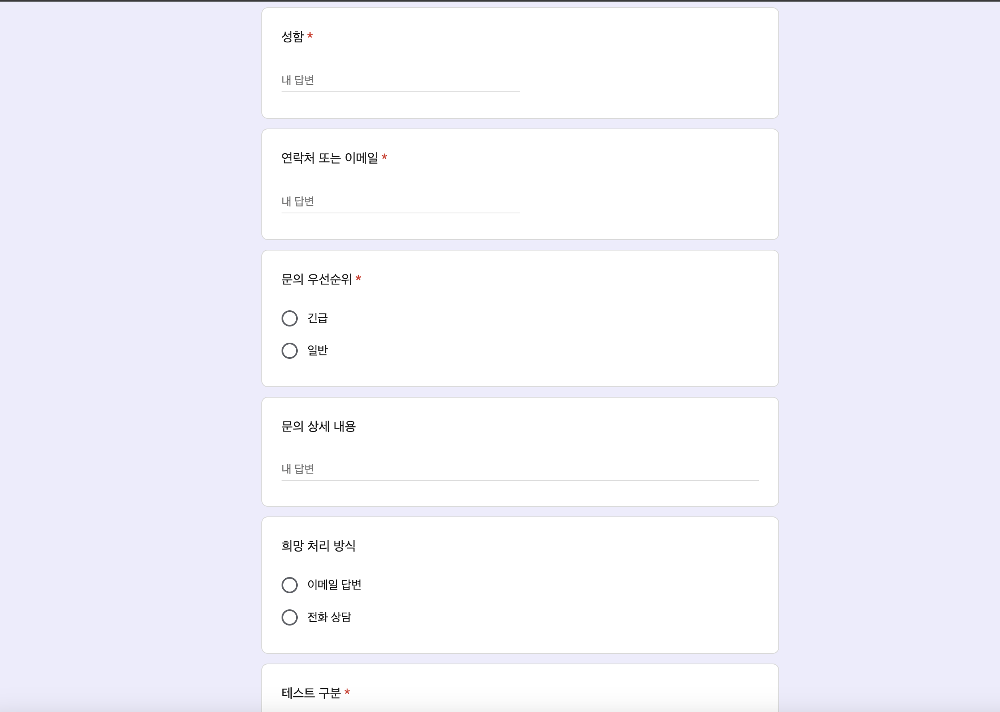

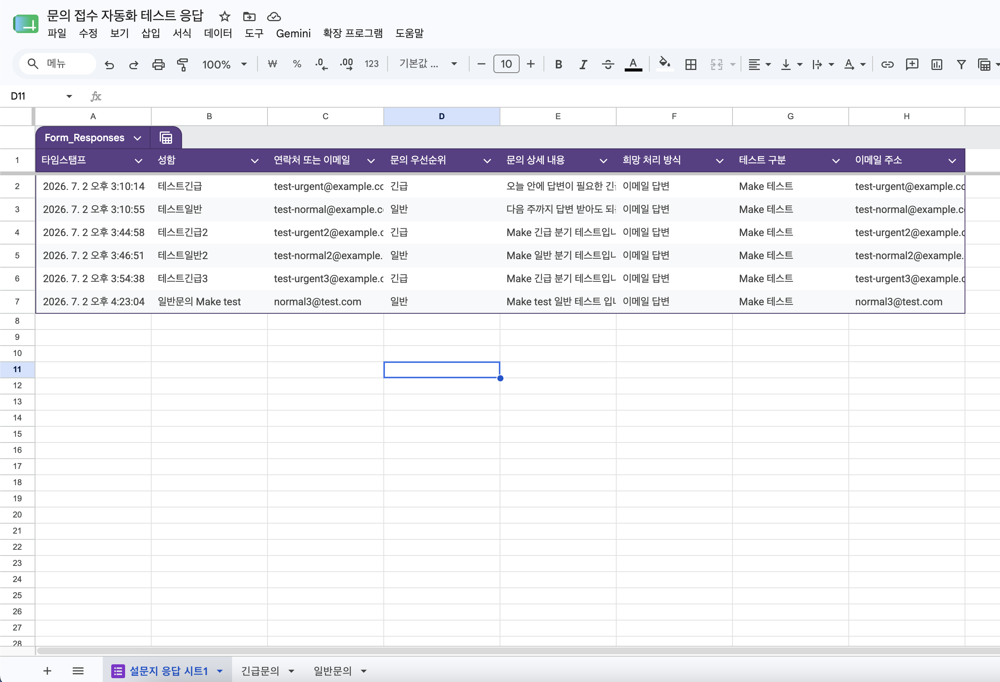

### Make 구현

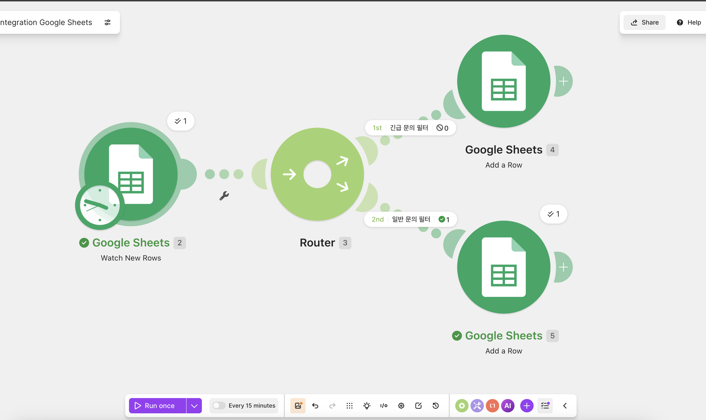

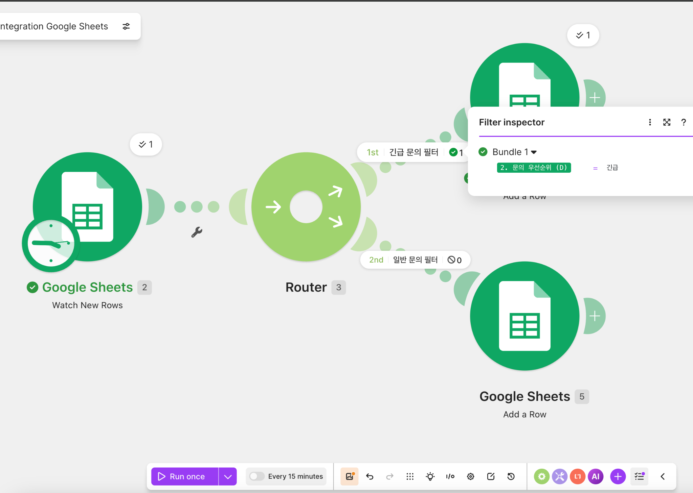

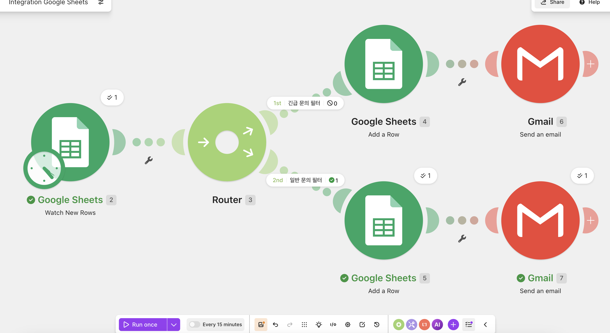

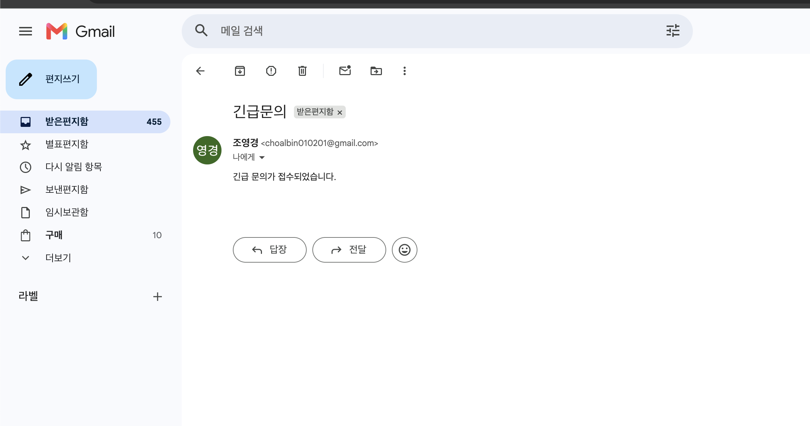

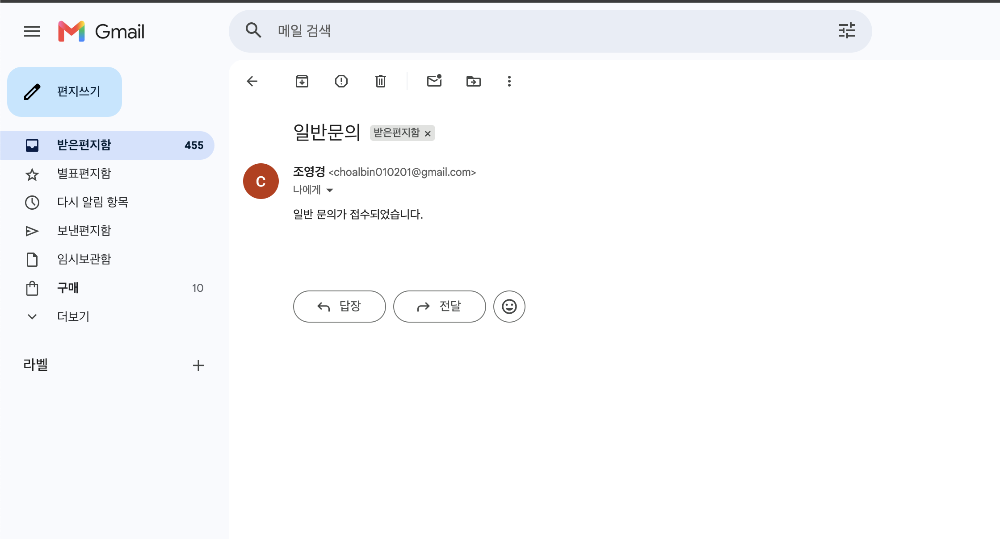

### Zapier 구현


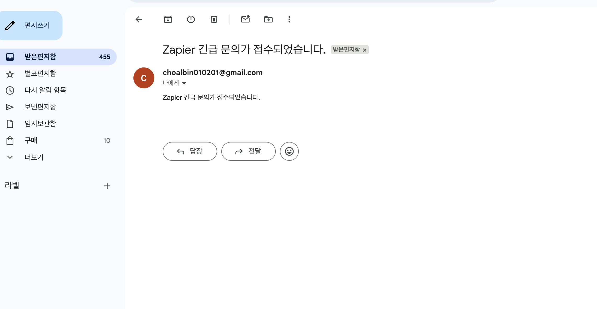


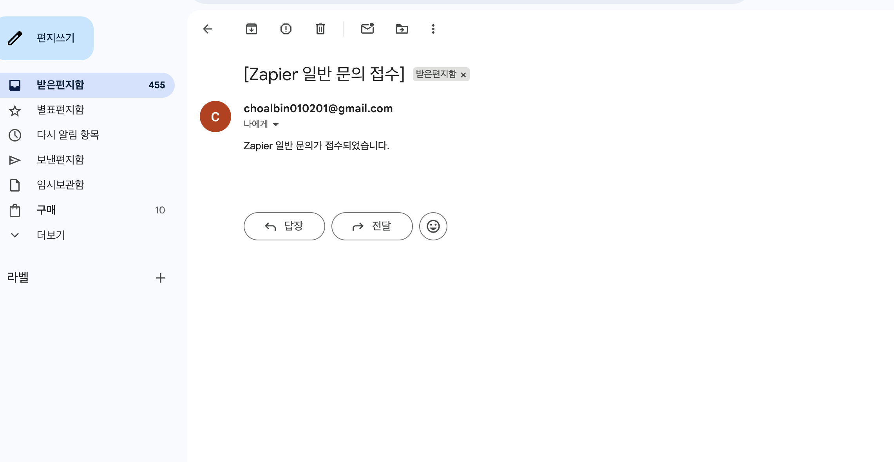

---

# 프로젝트 2. 자유 주제 자동화 설계 및 구현

## 1. 프로젝트 개요

프로젝트 2에서는 자유 주제로 반복 업무를 선정하고, 노코드 자동화 도구를 활용하여 실제 자동화 워크플로우를 설계하고 구현했다.

선정한 주제는 **홍보 포스터 제작 문의 자동 분류 및 알림 시스템**이다.

소상공인이나 가게 운영자가 Google Form을 통해 홍보 포스터 제작 문의를 제출하면, Google Sheets에 응답이 저장되고 Make가 이를 감지한다. 이후 문의의 긴급 여부에 따라 긴급 제작 문의와 일반 제작 문의로 분기하고, 각각 별도 시트에 기록한 뒤 Gmail로 알림을 전송한다.

---

## 2. 자동화 대상 업무

홍보 포스터 제작 문의가 들어오면 제작자가 직접 문의 내용을 확인하고, 긴급 문의인지 일반 문의인지 판단한 뒤, 별도 문서나 시트에 정리하고 메일로 확인해야 한다.

본 자동화의 목적은 포스터 제작 문의 접수 이후의 반복적인 분류, 기록, 알림 업무를 자동화하여 문의 확인 시간을 줄이고, 긴급 문의를 빠르게 파악할 수 있도록 하는 것이다.

---

## 3. 사용 도구

| 구분 | 사용 도구 | 역할 |
|---|---|---|
| 입력 도구 | Google Form | 포스터 제작 문의 접수 |
| 데이터 저장 | Google Sheets | 문의 응답 및 분류 결과 저장 |
| 자동화 도구 | Make | Trigger, Router, Action 자동화 |
| 알림 도구 | Gmail | 긴급/일반 문의 알림 전송 |

---

## 4. Google Form 설계

Google Form 제목은 **홍보 포스터 제작 문의 폼**으로 설정했다.

| 항목 | 설명 |
|---|---|
| 의뢰자 이름 | 포스터 제작을 요청한 사람의 이름 |
| 연락처 또는 이메일 | 문의자 연락처 |
| 가게 종류 | 카페, 식당, 미용실, 학원, 기타 등 |
| 포스터 제작 목적 | 이벤트 홍보, 신메뉴 홍보, 신규 고객 유입 등 |
| 희망 납기 | 3일 이내, 1주일 이내, 상관없음 |
| 긴급 여부 | 긴급 / 일반 |
| 요청 내용 | 구체적인 제작 요청 내용 |

조건 분기의 기준은 **긴급 여부** 항목이다.

---

## 5. Google Sheets 설계

| 시트 탭 이름 | 용도 |
|---|---|
| Form_Responses | Google Form 원본 응답 저장 |
| 긴급제작문의 | 긴급 제작 문의 자동 기록 |
| 일반제작문의 | 일반 제작 문의 자동 기록 |

`긴급제작문의`와 `일반제작문의` 탭의 헤더는 다음과 같이 구성했다.

```text
타임스탬프 | 의뢰자 이름 | 연락처 또는 이메일 | 가게 종류 | 포스터 제작 목적 | 희망 납기 | 긴급 여부 | 요청 내용 | 처리상태
```

---

## 6. Make 자동화 워크플로우

```text
Google Sheets - Watch New Rows
↓
Router
├─ 긴급 제작 문의 필터
│  ├─ Google Sheets - Add a Row → 긴급제작문의
│  └─ Gmail - Send an Email → 긴급 알림
└─ 일반 제작 문의 필터
   ├─ Google Sheets - Add a Row → 일반제작문의
   └─ Gmail - Send an Email → 일반 알림
```

---

## 7. Trigger, Router, Action 구성

| 구분 | 구현 내용 |
|---|---|
| Trigger | Google Sheets - Watch New Rows |
| Router | 긴급 제작 문의 / 일반 제작 문의 분기 |
| 긴급 필터 | 긴급 여부 = 긴급 |
| 일반 필터 | 긴급 여부 = 일반 |
| Action 1 | Google Sheets - Add a Row |
| Action 2 | Gmail - Send an Email |

---

## 8. 긴급 제작 문의 경로

긴급 제작 문의는 `긴급제작문의` 시트에 자동으로 기록된다.

| 열 | 입력값 |
|---|---|
| 타임스탬프 | 폼 응답의 타임스탬프 |
| 의뢰자 이름 | 폼 응답의 의뢰자 이름 |
| 연락처 또는 이메일 | 폼 응답의 연락처 또는 이메일 |
| 가게 종류 | 폼 응답의 가게 종류 |
| 포스터 제작 목적 | 폼 응답의 포스터 제작 목적 |
| 희망 납기 | 폼 응답의 희망 납기 |
| 긴급 여부 | 폼 응답의 긴급 여부 |
| 요청 내용 | 폼 응답의 요청 내용 |
| 처리상태 | 긴급 접수 |

긴급 문의가 접수되면 Gmail로 긴급 알림 메일이 전송된다.

```text
[긴급 포스터 제작 문의] 의뢰자 이름
```

---

## 9. 일반 제작 문의 경로

일반 제작 문의는 `일반제작문의` 시트에 자동으로 기록된다.

| 열 | 입력값 |
|---|---|
| 타임스탬프 | 폼 응답의 타임스탬프 |
| 의뢰자 이름 | 폼 응답의 의뢰자 이름 |
| 연락처 또는 이메일 | 폼 응답의 연락처 또는 이메일 |
| 가게 종류 | 폼 응답의 가게 종류 |
| 포스터 제작 목적 | 폼 응답의 포스터 제작 목적 |
| 희망 납기 | 폼 응답의 희망 납기 |
| 긴급 여부 | 폼 응답의 긴급 여부 |
| 요청 내용 | 폼 응답의 요청 내용 |
| 처리상태 | 일반 접수 |

일반 문의가 접수되면 Gmail로 일반 알림 메일이 전송된다.

```text
[일반 포스터 제작 문의] 의뢰자 이름
```

---

## 10. 테스트 결과

| 테스트 | 예상 결과 | 실제 결과 |
|---|---|---|
| 긴급 문의 테스트 | 긴급제작문의 시트에 기록 및 Gmail 긴급 알림 전송 | 정상 실행 |
| 일반 문의 테스트 | 일반제작문의 시트에 기록 및 Gmail 일반 알림 전송 | 정상 실행 |

---

## 11. 과제 요구사항 충족 여부

| 요구사항 | 구현 내용 | 충족 여부 |
|---|---|---|
| 자동화할 반복 업무 선정 | 홍보 포스터 제작 문의 분류 및 알림 | 충족 |
| Trigger 1개 이상 | Google Sheets - Watch New Rows | 충족 |
| Action 2개 이상 | Google Sheets Add a Row, Gmail Send an Email | 충족 |
| Filter 또는 Router 1개 이상 | Make Router 및 긴급/일반 필터 | 충족 |
| 각 분기 실행 확인 | 긴급 문의와 일반 문의 각각 테스트 | 충족 |
| 실제 동작 확인 | 시트 기록 및 Gmail 수신 확인 | 충족 |

---

## 12. 프로젝트 2 스크린샷


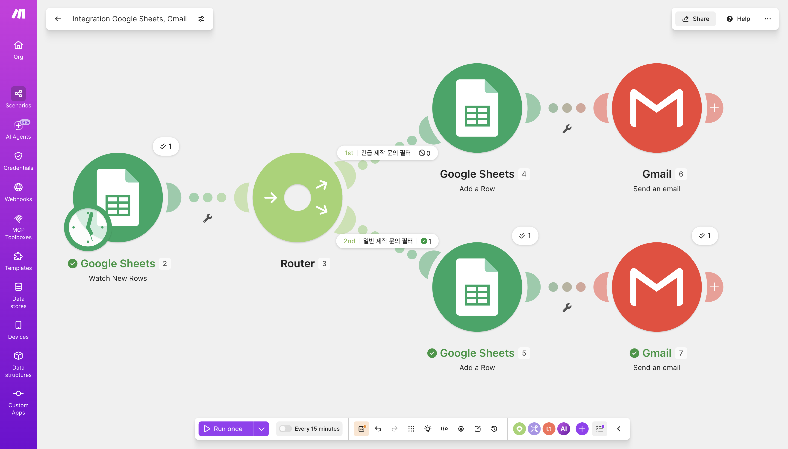

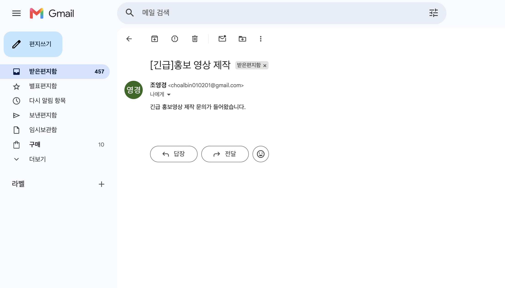

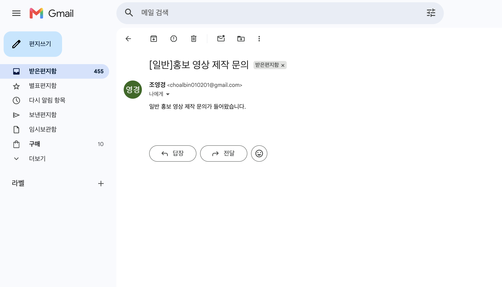

---

## 13. 프로젝트 2 결론

프로젝트 2에서는 자유 주제로 **홍보 포스터 제작 문의 자동 분류 및 알림 시스템**을 설계하고 Make로 구현했다. Google Form, Google Sheets, Make, Gmail을 연동하여 문의 접수부터 분류, 기록, 알림까지의 반복 업무를 자동화했다.

이번 구현을 통해 Trigger, Router, Filter, Action이 실제 업무 자동화에서 어떻게 연결되는지 확인할 수 있었다. 특히 긴급 문의와 일반 문의를 자동으로 분리함으로써 업무 처리 우선순위를 빠르게 판단할 수 있었고, 단순 반복 업무를 줄이는 자동화의 효과를 확인할 수 있었다.

---

# 전체 결론

Mission03에서는 노코드 자동화 도구를 활용해 실제로 작동하는 자동화 워크플로우를 구현했다.

프로젝트 1에서는 Make와 Zapier를 비교하며 같은 자동화 흐름을 서로 다른 도구로 구현했고, 프로젝트 2에서는 자유 주제로 홍보 포스터 제작 문의 자동화 시스템을 설계했다.

두 프로젝트 모두 Trigger, Action, Filter/Router 조건을 포함했으며, 긴급 분기와 일반 분기를 각각 실행하여 실제 동작을 확인했다.

---

# 추가 보완: 핵심 기술 원리 적용

## 1. 이벤트 기반 자동화 구조

이번 과제의 자동화는 사용자가 직접 버튼을 누르지 않아도 특정 이벤트가 발생하면 자동으로 다음 작업이 실행되는 **이벤트 기반 구조**로 설계했다.

프로젝트 1과 프로젝트 2 모두 Google Form 제출이 시작점이다. Google Form 응답은 Google Sheets에 새 행으로 저장되고, Make 또는 Zapier가 이 새 행을 감지해 자동화가 시작된다.

```text
사용자 입력 이벤트
↓
Google Sheets 새 행 생성
↓
자동화 도구가 Trigger 감지
↓
조건 판단
↓
Action 실행
```

이 구조를 통해 문의 접수, 분류, 기록, 알림이라는 반복 업무를 사람이 직접 수행하지 않아도 자동으로 처리할 수 있다.

---

## 2. Trigger 원리

Trigger는 자동화가 시작되는 조건이다.

이번 과제에서는 Google Sheets의 새 행 추가를 Trigger로 사용했다.

| 프로젝트 | 도구 | Trigger |
|---|---|---|
| 프로젝트 1 | Make | Google Sheets - Watch New Rows |
| 프로젝트 1 | Zapier | Google Sheets - New or Updated Spreadsheet Row |
| 프로젝트 2 | Make | Google Sheets - Watch New Rows |

Make의 `Watch New Rows`는 Google Sheets에 새로운 응답 행이 추가되었는지 확인하고, 새 데이터가 있으면 이후 모듈을 실행한다. Zapier의 `New or Updated Spreadsheet Row`도 시트의 새로운 행 또는 수정된 행을 감지해 Zap을 실행한다.

즉, Trigger는 “자동화의 시작 신호” 역할을 한다.

---

## 3. Action 원리

Action은 Trigger 이후 실제로 수행되는 작업이다.

이번 과제에서는 각 분기마다 두 가지 Action을 사용했다.

```text
Action 1: Google Sheets에 행 추가
Action 2: Gmail 알림 전송
```

Google Sheets Action은 긴급 문의와 일반 문의를 각각 별도 탭에 기록하기 위해 사용했다. Gmail Action은 문의가 들어왔음을 담당자가 바로 확인할 수 있도록 메일 알림을 보내기 위해 사용했다.

| Action | 적용 이유 |
|---|---|
| Google Sheets Add a Row / Create Spreadsheet Row | 분류된 문의를 누락 없이 기록하기 위해 사용 |
| Gmail Send an Email | 담당자에게 문의 접수 사실을 즉시 알리기 위해 사용 |

---

## 4. Filter와 Router 원리

Filter와 Router는 조건에 따라 데이터 흐름을 나누는 역할을 한다.

프로젝트 1의 Make 구현에서는 Router를 사용해 하나의 시나리오 안에서 긴급 문의와 일반 문의를 나누었다.

```text
Router
├─ 문의 우선순위 = 긴급
└─ 문의 우선순위 = 일반
```

Zapier에서는 `Filter by Zapier`를 사용했다. 무료 플랜에서는 Make처럼 하나의 화면에서 여러 경로를 구성하는 것이 제한될 수 있어 긴급용 Zap과 일반용 Zap을 따로 구성했다.

프로젝트 2에서는 Make Router를 사용해 `긴급 여부 = 긴급`과 `긴급 여부 = 일반` 조건으로 분기했다.

이처럼 Filter와 Router는 자동화에서 “판단 기준” 역할을 한다.

---

## 5. API 연동 원리

Make와 Zapier는 내부적으로 Google Sheets와 Gmail의 API를 사용해 데이터를 읽고 쓰는 방식으로 동작한다.

사용자는 코드를 직접 작성하지 않았지만, 실제 동작은 다음과 같은 API 호출 흐름으로 이해할 수 있다.

```text
Google Sheets API
- 새 행 감지
- 특정 시트에 행 추가

Gmail API
- 지정된 수신자에게 이메일 전송
```

노코드 도구는 복잡한 API 인증, 요청 형식, 응답 처리를 시각적 블록으로 감싸서 제공한다. 그래서 사용자는 코딩 없이도 API 기반 자동화를 구성할 수 있다.

---

## 6. 데이터 매핑 원리

데이터 매핑은 Trigger에서 가져온 값을 Action 단계의 입력값으로 연결하는 과정이다.

예를 들어 Google Form에서 입력된 `성함`, `문의 우선순위`, `문의 상세 내용`은 Google Sheets의 각 열과 Gmail 본문에 연결되었다.

```text
Trigger 데이터: 성함
↓
Action 1: Google Sheets의 성함 열에 입력
↓
Action 2: Gmail 본문에 성함으로 삽입
```

이 과정이 제대로 설정되지 않으면 모든 메일에 같은 테스트 값이 들어가거나, 시트에 빈 값이 기록될 수 있다. 따라서 각 필드를 직접 고정 입력하지 않고, Trigger에서 가져온 동적 데이터로 매핑했다.

---

## 7. 인증과 권한 원리

Make와 Zapier가 Google Sheets와 Gmail에 접근하려면 사용자의 Google 계정 권한이 필요하다.

이번 과제에서는 Google 계정을 연결하고, 자동화 도구가 Google Sheets를 읽고 쓰며 Gmail을 보낼 수 있도록 권한을 허용했다.

이 과정은 OAuth 인증에 해당한다. 사용자는 비밀번호를 자동화 도구에 직접 입력하지 않고, Google의 권한 승인 화면을 통해 필요한 범위만 허용한다.

---

## 8. 실행 로그와 검증 원리

자동화는 실제로 실행되었는지 확인하는 과정이 중요하다.

이번 과제에서는 다음 방식으로 검증했다.

| 검증 항목 | 확인 방법 |
|---|---|
| Trigger 실행 여부 | Make 실행 결과와 Zapier Test run 확인 |
| Filter 통과 여부 | 긴급/일반 분기별 실행 결과 확인 |
| Sheets 기록 여부 | 긴급문의, 일반문의, 긴급제작문의, 일반제작문의 탭 확인 |
| Gmail 알림 여부 | 긴급 메일과 일반 메일 수신 확인 |
| 각 분기 실행 여부 | 긴급 테스트와 일반 테스트를 각각 제출 |

이를 통해 단순히 워크플로우를 만든 것이 아니라 실제 데이터가 들어왔을 때 자동화가 동작하는지 확인했다.

---

# 추가 보완: 심층 인터뷰 문항 답변

## 질문 1. 노코드 자동화 도구의 가장 큰 장점은 무엇인가?

노코드 자동화 도구의 가장 큰 장점은 코드를 작성하지 않고도 여러 서비스를 연결해 반복 업무를 자동화할 수 있다는 점이다.

이번 과제에서도 Google Form, Google Sheets, Gmail을 Make와 Zapier로 연결하여 문의 접수, 분류, 기록, 알림 업무를 자동화했다. 만약 직접 코딩한다면 Google API 인증, 데이터 읽기, 조건 분기, 이메일 발송 코드를 모두 작성해야 하지만, 노코드 도구에서는 모듈을 연결하고 필드를 매핑하는 방식으로 빠르게 구현할 수 있었다.

---

## 질문 2. 노코드 자동화 도구의 한계는 무엇인가?

노코드 자동화 도구는 빠르게 자동화를 만들 수 있지만 다음과 같은 한계가 있다.

| 한계 | 설명 |
|---|---|
| 복잡한 로직 구현의 어려움 | 다중 조건, 반복 처리, 예외 처리 등이 많아지면 시각적 워크플로우가 복잡해진다. |
| 무료 플랜 제한 | Zapier의 Paths, 실행 횟수, 일부 앱 연동은 요금제 제한을 받을 수 있다. |
| 세밀한 오류 처리 부족 | 코딩처럼 try-catch, 재시도 로직, 상세 로그 저장을 자유롭게 설계하기 어렵다. |
| 성능 및 속도 제한 | 많은 데이터가 빠르게 들어오는 경우 실행 지연이나 작업량 제한이 발생할 수 있다. |
| 버전 관리 어려움 | Git처럼 변경 이력을 체계적으로 관리하기 어렵다. |
| 보안 통제 제한 | 외부 도구에 계정 권한을 부여해야 하므로 권한 관리가 중요하다. |

이번 과제에서도 Zapier에서는 Make의 Router처럼 하나의 흐름 안에서 긴급/일반 분기를 구성하기보다 긴급용 Zap과 일반용 Zap을 따로 만들어야 했다. 이 점은 노코드 도구의 플랜 제한과 구조적 한계를 보여준다.

---

## 질문 3. 코딩 기반 자동화로 확장한다면 어떻게 개선할 수 있는가?

코딩 기반으로 확장한다면 다음과 같이 개선할 수 있다.

```text
Google Form / Google Sheets
↓
Google Apps Script 또는 Python 서버
↓
조건 분류 로직
↓
Database 저장
↓
Gmail / Slack / Kakao 알림
↓
관리자 대시보드
```

구체적인 확장 아이디어는 다음과 같다.

| 확장 방향 | 설명 |
|---|---|
| Google Apps Script 적용 | Google Sheets에 새 행이 추가될 때 Apps Script가 실행되도록 만들 수 있다. |
| Python 서버 구축 | FastAPI 서버를 만들어 Webhook 요청을 받고 더 복잡한 로직을 처리할 수 있다. |
| 데이터베이스 연동 | Google Sheets 대신 MySQL, PostgreSQL, Firebase 등에 문의 데이터를 저장할 수 있다. |
| 관리자 대시보드 | 긴급 문의 처리 상태, 미처리 문의 수, 처리 완료율을 웹 화면으로 확인할 수 있다. |
| 오류 재시도 로직 | 메일 발송 실패 시 자동 재시도하거나 실패 로그를 남길 수 있다. |
| AI 분류 추가 | 문의 내용을 LLM으로 분석해 긴급도, 감정, 카테고리를 자동 분류할 수 있다. |

---

## 질문 4. 이번 자동화를 실제 서비스로 운영한다면 어떤 점을 보완해야 하는가?

실제 서비스로 운영한다면 다음 항목을 보완해야 한다.

첫째, 중복 실행 방지가 필요하다. 같은 응답이 여러 번 처리되지 않도록 고유 ID를 만들고, 이미 처리한 행인지 확인하는 로직이 필요하다.

둘째, 개인정보 보호가 필요하다. 문의자의 이름, 연락처, 이메일이 포함되므로 접근 권한을 제한하고, 제출용 스크린샷에서는 개인정보를 마스킹해야 한다.

셋째, 오류 처리와 재시도 로직이 필요하다. Gmail 발송 실패, Google Sheets 연결 오류, 권한 만료 등이 발생할 수 있으므로 실패 로그를 기록하고 재시도할 수 있어야 한다.

넷째, 처리 상태 관리가 필요하다. 단순히 “접수됨”만 기록하는 것이 아니라 `접수됨`, `처리중`, `완료`, `보류`처럼 상태를 관리하면 실제 업무에 더 적합하다.

---

## 질문 5. Make와 Zapier 중 어떤 도구가 더 적합했는가?

이번 과제에서는 Make가 더 적합했다.

Make는 Router를 사용해 하나의 시나리오 안에서 긴급 문의와 일반 문의를 분리할 수 있었고, 실행 결과에서도 각 분기가 몇 번 통과했는지 시각적으로 확인하기 쉬웠다.

Zapier는 단계별 설정 방식이 직관적이라 초보자가 사용하기 쉬웠지만, Make와 같은 분기 구조를 무료 플랜에서 하나의 Zap으로 구현하기에는 제한이 있어 긴급용 Zap과 일반용 Zap을 따로 만들었다.

따라서 단순한 자동화는 Zapier가 편리하고, 조건 분기와 여러 경로가 포함된 자동화는 Make가 더 적합하다고 판단했다.

---

## 질문 6. 이번 과제에서 가장 어려웠던 점은 무엇인가?

가장 어려웠던 점은 Trigger에서 가져온 데이터를 각 Action 필드에 정확히 매핑하는 것이었다.

Zapier와 Make 모두 테스트 데이터가 예시로 표시되기 때문에 처음에는 해당 값이 고정 입력되는 것처럼 보였다. 하지만 실제로는 이전 단계의 동적 필드를 선택해야 새 응답마다 다른 값이 자동으로 들어간다.

또한 Router와 Filter 조건을 정확히 설정하지 않으면 일반 문의가 긴급 문의 시트에 들어가거나, 필터를 통과하지 못해 Action이 실행되지 않을 수 있다. 따라서 긴급 테스트와 일반 테스트를 각각 제출하여 두 분기가 모두 정상 실행되는지 확인했다.

---

## 질문 7. 노코드 자동화와 코딩 기반 자동화의 차이는 무엇인가?

노코드 자동화는 빠른 구현과 쉬운 사용성이 장점이다. 반면 코딩 기반 자동화는 구현 시간이 더 오래 걸리지만, 복잡한 로직과 예외 처리를 더 세밀하게 설계할 수 있다.

| 구분 | 노코드 자동화 | 코딩 기반 자동화 |
|---|---|---|
| 구현 속도 | 빠름 | 상대적으로 느림 |
| 진입 장벽 | 낮음 | 높음 |
| 복잡한 로직 | 제한적 | 자유롭게 구현 가능 |
| 오류 처리 | 도구 기능에 의존 | 직접 설계 가능 |
| 버전 관리 | 제한적 | Git으로 관리 가능 |
| 확장성 | 도구 플랜과 기능에 영향 | 서버, DB, API로 확장 가능 |

이번 과제는 비교적 단순한 문의 분류와 알림 업무였기 때문에 노코드 도구로 충분히 구현할 수 있었다. 하지만 실제 서비스 규모로 확장한다면 코딩 기반 구조가 더 안정적일 수 있다.

---

## 질문 8. 이번 자동화에서 데이터 흐름을 설명하시오.

데이터 흐름은 다음과 같다.

```text
1. 사용자가 Google Form 제출
2. Google Sheets의 Form_Responses 탭에 새 행 생성
3. Make 또는 Zapier가 새 행을 Trigger로 감지
4. 문의 우선순위 또는 긴급 여부 값을 확인
5. Filter/Router가 긴급 또는 일반 경로로 분기
6. 해당 분기 시트에 새 행 추가
7. Gmail로 담당자에게 알림 전송
8. 사용자는 시트와 메일을 통해 자동화 결과 확인
```

이 흐름에서 핵심은 입력 데이터가 한 번 들어오면 사람이 직접 복사하거나 메일을 작성하지 않아도 기록과 알림이 자동으로 이어진다는 점이다.

---

## 질문 9. 향후 개선하고 싶은 기능은 무엇인가?

향후에는 AI를 활용한 자동 분류 기능을 추가하고 싶다.

현재는 사용자가 직접 `긴급` 또는 `일반`을 선택해야 한다. 하지만 실제 서비스에서는 사용자가 긴급 여부를 잘못 선택할 수 있다. 따라서 문의 상세 내용을 LLM이 분석하여 긴급도를 자동 판단하도록 개선할 수 있다.

예를 들어 다음과 같은 기준을 사용할 수 있다.

```text
- 납기가 3일 이내이면 긴급
- 환불, 불만, 오류, 마감 임박과 같은 단어가 있으면 긴급 후보
- 단순 문의, 일반 안내 요청이면 일반
```

또한 처리 상태를 자동으로 업데이트하고, 미처리 문의가 일정 시간 이상 남아 있으면 추가 알림을 보내는 기능도 확장할 수 있다.

---

# 최종 보완 결론

기존 제출물은 Make와 Zapier를 사용한 자동화 구현과 기본 비교 분석은 포함하고 있었지만, 노코드 자동화의 한계, 코딩 기반 확장 아이디어, 핵심 기술 원리 적용에 대한 설명이 부족했다.

이번 보완에서는 Trigger, Action, Filter/Router, API 연동, 데이터 매핑, 인증, 실행 로그 검증 원리를 추가로 설명했다. 또한 심층 인터뷰 문항 형식으로 노코드 자동화의 장단점, 한계, 코딩 기반 확장 방향, 실제 서비스 운영 시 보완점까지 정리했다.

이를 통해 단순히 워크플로우를 만든 것뿐 아니라, 자동화가 어떤 원리로 작동하고 어떤 방식으로 확장될 수 있는지 설명할 수 있도록 보완했다.
